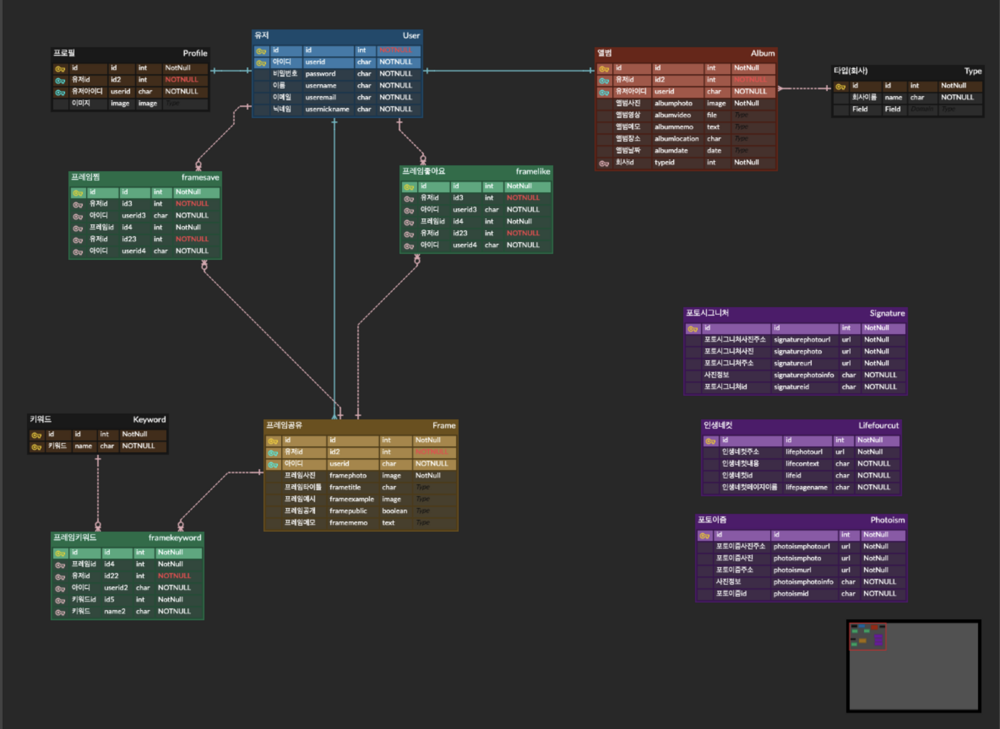
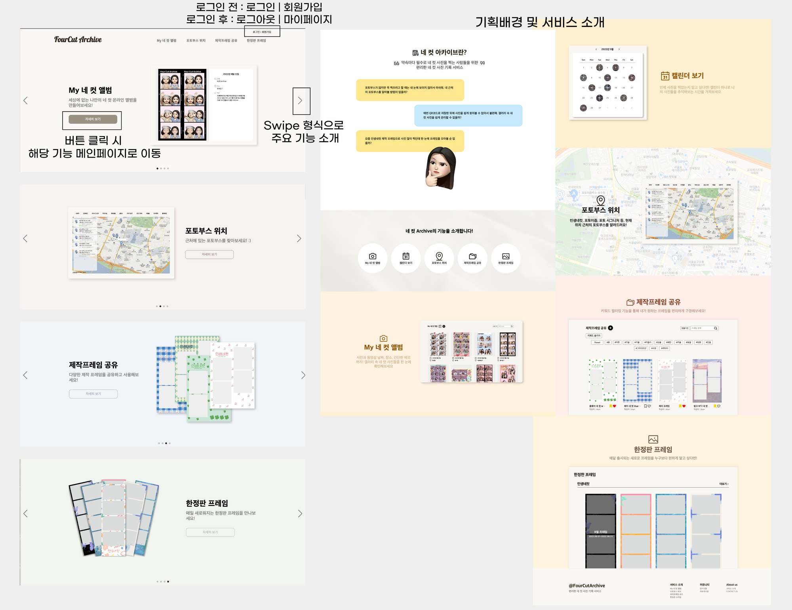
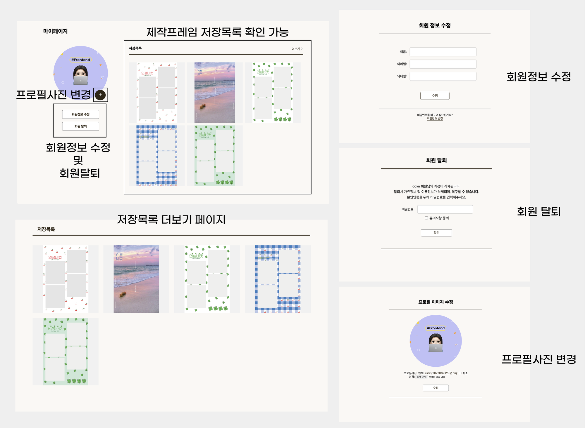
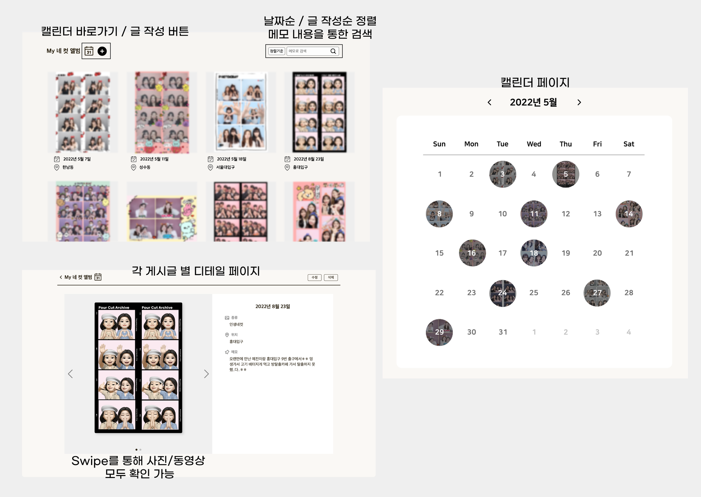
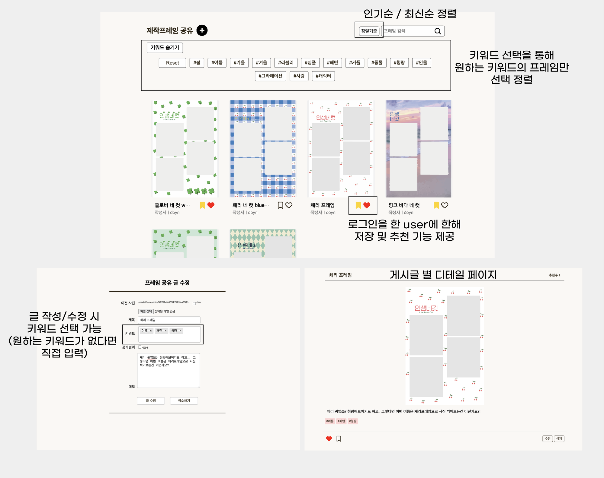

  
# 📸FourCut Archive

```  
네 컷 사진 기록 및 인생 네 컷 프레임 공유 서비스
```

테스트 서버  ❗[https://fourcutarchive.com/](https://fourcutarchive.com/)❗  

## 💡기획배경
 QR을 통해 다운로드 받은 네 컷 사진, 동영상이 항상 갤러리에서 다른 사진들과 섞이는 것이 항상 아쉬웠습니다. 따라서 다운로드 받은 네 컷 사진을 한 공간에서 모아볼 수 있으면 어떨까 하는 생각으로부터 네 컷 사진 앨범의 아이디어가 나오게 되었습니다.   
 노션 링크 [https://six-puppy-7ec.notion.site/Archive-abcee6de877049228af3df93252e905c](https://six-puppy-7ec.notion.site/Archive-abcee6de877049228af3df93252e905c)


## 🔨 Tools
- <b>Prototype</b> :   
- <b>Framework</b> :   
- <b>Deployment</b> :   
- <b>Collaboration</b> :   

## 📝 ERD


<hr>

## 🔥 사이트 소개

### 1. 메인 페이지
<details>
  <summary>주 기능: Four Cut Archive 서비스 설명 및 각 기능별 메인페이지로 이동  </summary>
  <div>
    - 상단의 메뉴바를 통해 각 기능의 메인페이지로 이동할 수 있다.<br />
    - 가장 상단의 swipe의 ‘자세히보기' 버튼을 통해 각 기능의 메인페이지로 이동할 수 있다.  <br />
    - 로그인 이전에는 로그인과 회원가입이, 로그인 이후에는 로그아웃과 마이페이지의 메뉴로 이동할 수 있다.  <br />
    - 메인페이지 하단에는 Four Cut Archive의 기능과 관련된 설명을 확인할 수 있다.
  </div>
</details>
  


### 2. 로그인 페이지
<details>
  <summary>주 기능: 로그인, 소셜로그인, 아이디 찾기, 비밀번호 찾기, 회원가입/(유저관리)</summary>
  <div>
    - <b>회원가입</b> : 해당 서비스의 전체 기능을 사용하기 위해서는 회원가입이 필요하다.  <br />
    - <b>로그인</b> : 회원가입을 한 뒤 아이디와 비밀번호를 통해 로그인이 가능하다.  <br />
    - <b>소셜 로그인</b> : 구글, 네이버, 카카오 소셜로그인을 통해 서비스 이용이 가능하다.  <br />
    - <b>아이디 찾기</b> : 회원가입 시 작성한 이름과 이메일을 통해 아이디 찾기가 가능하다.  <br />
    - <b>비밀번호 찾기</b>: 회원가입 시 작성한 이메일을 통해 비밀번호 재설정이 가능하다.  
  </div>
</details>
  

### 3. 마이 페이지
<details>
  <summary>주 기능: 회원정보와 비밀번호 수정, 회원 탈퇴, 저장목록 확인, 프로필사진 변경/(유저관리)</summary>
  <div>
    - <b>회원정보 수정</b> : 이름과 이메일, 닉네임에 한해서 회원정보 수정이 가능하다.  <br />
        - <b>비밀번호 수정</b> 회원정보 수정창을 이용하여 들어갈 수 있으며, 기존의 비밀번호가 맞다고 확인되면 새로운 비밀번호를 입력하여 수정할 수 있다.  <br />
    - <b>프로필사진 변경</b> : 본인의 프로필 사진을 원하는 사진으로 변경할 수 있다.  <br />
    - <b>회원 탈퇴</b> : 유의사항에 동의한 유저에 한해 비밀번호 확인 후 회원 탈퇴가 진행된다.  <br />
    - <b>저장목록</b> : 제작프레임 공유 게시판에서 저장한 글을 마이페이지에서 한번에 모아볼 수 있다.
  </div>
</details>
  

### 4. My 네 컷 앨범
<details>
  <summary>주 기능: 네 컷 앨범 글 작성 및 수정, 캘린더 모아보기/(CRUD,캘린더)</summary>
  <div>
    - QR코드로 다운로드 받은 본인의 <b>네 컷 사진과 동영상</b>을 <b>게시하는 공간</b>이다.  <br />
    - 메인 페이지에서는 사진, 날짜, 장소를 확인할 수 있으며, 글 작성 최신순, 사진을 찍은 날짜 순으로 정렬해서 볼 수 있다.  <br />
    - 디테일 페이지에서는 사진과 동영상을 <b>swipe 기능</b>을 통해 모두 확인 가능하며, 글 작성 시 적어뒀던 날짜, 메모, 장소, 포토부스 종류를 확인할 수 있다.  <br />
    - <b>캘린더 페이지</b>에서는 월 별 본인이 찍은 네 컷 사진을 한 눈에 확인할 수 있다.  
  </div>
</details>
 

### 5. 포토부스 위치
<details>
  <summary>주 기능: 현 위치 주변 포토부스 검색, 장소 검색을 통한 주변 포토부스 위치 확인/(Kakao 지도)</summary>
  <div>
    - 현 위치 버튼을 클릭하면 <b>본인 주변의 포토부스의 위치</b>를 모두 확인할 수 있다.  <br />
    - 현 위치가 아닌 다른 장소의 포토부스 위치를 알고싶다면 <b>장소 검색</b>을 통해 확인할 수 있다.  <br />
    - <b>원하는 업체의 포토부스만</b>을 선택해서 위치를 알 수 있다.  
  </div>
</details>
 

### 6. 제작프레임 공유
<details>
  <summary>주 기능: 제작 프레임 글 작성 및 수정, 키워드를 통한 필터링, 글 추천 및 저장/(CRUD,Tagify)</summary>
  <div>
    - <b>키워드 태그</b>를 다중 선택하여 or 연산으로 검색 할 수 있다. <br />
    - 글 작성 시 원하는 키워드를 선택할 수 있으며, 원하는 키워드가 없는 경우 직접 입력이 가능하다.<br />
    - 로그인 한 user에 한해 <b>추천과 저장 기능</b>을 제공한다.<br />
    - 여기에서 저장한 게시글들은 마이페이지에서 모아볼 수 있다.<br />
    - 추천 수를 기준으로 한 인기순 정렬과 최신순 정렬이 가능하다.
  </div>
</details>
 

### 7. 한정판 프레임
<details>
  <summary>주 기능: 한정판 프레임 및 이달의 프레임 확인, 인스타그램 글 모아보기/(크롤링)</summary>
  <div>
    - 인생네컷, 포토이즘, 포토시그니처에 한해 <b>한정판 프레임 혹은 인스타그램 게시글</b>을 모아볼 수 있다. <br />
    - 인생네컷에서는 프레임에 마우스를 올리면 몇 월의 한정판 프레임인지 확인이 가능하다.<br />
    - 포토이즘과 포토시그니처의 경우 게시글을 클릭하면 해당 인스타그램 게시물로 연결된다.<br />
  </div>
</details>
 

